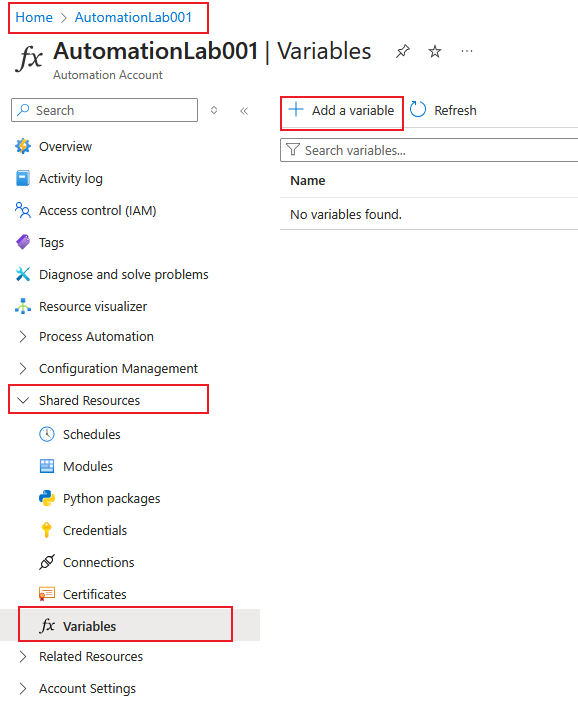
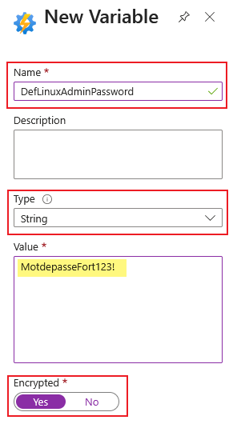
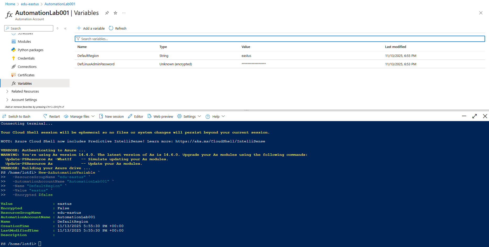

# Les variables dans Azure Automation

## Introduction
Quand on parle d'Azure Automation, on pense souvent aux runbooks, à Powershell, aux workflows, mais beaucoup moins aux variables. Et pourtant, elles font partie de ces petits détails qui rendent une automation fluide, claire et agréable à maintenir.

C'est un peu comme un carnet de notes partagé entre vos scripts. Au lieu de réecrire la même information partout, vous la centralisez, et tout devient plus simple.

## Pourquoi s'en servir ?
Dans la vraie vie, les environnements changent, le nom d'un groupe de ressource, une clé API, un compte de stockage. Si vous avez hardcodé ces informations (nom du compte de stockage, nom du groupe de ressource...) dans vos runbooks, dans plusieurs endroits, eh bien le jour du changement ce n'est pas la chasse au oeuf que vous allez faire mais la chasse au texte. OK c'est plus facile aujourd'hui avec l'IA, mais pourquoi faire compliqué quand on peut faire plus simple (KISS protocol).

Les variables servent justement a vos sauver des minutes voir des heures  le jour J. On stock l'information dans une variable, et on fait appel a cette variable quand on a besoin, ainsi, le jour du changement, on aura que la ligne de la variable a changer, et le code se mettra à jour instatanement.

C'est plus propre, et surtout c'est plus élégant.

## Le principe :
Une variable, est une valeur stockée dans votre compte Azure Automation.
Elle peut être de type : 
- Texte (string)
- nombre (integer)
- booléen (true/false)
- date
- null (vide)

On peut créer les variables depuis le Portail Azure, ou via du Powershell/CLI, Bicep/ARM, ou même avec du Terraform.

## La sécurité dans tout ca ?
La question qui vient directement à l'esprit est : la variable est chiffré ou pas ?

Alors Azure propose deux types de variables :
- Non chiffrées : leur contenu est visible dans le portail et dans PowerShell.
- Chiffré : leur valeur est masquée et stockée de façon sécurisée.

Petite subtilité : une fois la variable créée, vous ne pouvez plus changer son statut de chiffrement. Si vous l'avez créée en clair, elle le restera.

## Créer une variable

### Depuis le **portail Azure**
- Ouvrez votre **Automation Account**
- Rendez-vous dans **Ressources partagées → Variables**
- Cliquez sur **Ajouter une variable**
- Choisissez le nom, le type, la valeur, et s’il faut la chiffrer
- Enregistrez.





Et voilà. C’est tout.
Une fois enregistrée, la variable devient immédiatement accessible depuis vos runbooks.

### En utilisant PowerShell

Pour créer une variable sans chiffrement :
```bash
New-AzAutomationVariable `
  -ResourceGroupName "edu-eastus" `
  -AutomationAccountName "AutomationLab001" `
  -Name "DefaultRegion" `
  -Value "eastus" `
  -Encrypted $false
```

Pour créer une variable avec chiffrement :
```Powershell
New-AzAutomationVariable `
  -ResourceGroupName "edu-eastus" `
  -AutomationAccountName "AutomationLab001" `
  -Name "DefLinuxAdminPassword" `
  -Value "MotdepasseFort123!" `
  -Encrypted $true
```



### Lire une variable dans un runbook

Dans un runbook PowerShell, la lecture est très simple :
```PowerShell
$region = Get-AutomationVariable -Name "DefaultRegion"
$password = Get-AutomationVariable -Name "DefLinuxAdminPassword"
``` 

La belle particularité, c’est que même les variables chiffrées peuvent être lues à l’intérieur du runbook — puisque celui-ci s’exécute avec les permissions nécessaires.

C’est ce qui vous permet de garder vos secrets sécurisés tout en automatisant sans contrainte.

### Modifier ou supprimer

Besoin de mettre à jour la valeur ?
```PowerShell
Set-AzAutomationVariable `
  -ResourceGroupName "edu-eastus" `
  -AutomationAccountName "AutomationLab001" `
  -Name "DefaultRegion" `
  -Value "northeurope"
```

Et pour nettoyer un peu :

```PowerShell
Remove-AzAutomationVariable `
  -ResourceGroupName "edu-eastus" `
  -AutomationAccountName "AutomationLab001" `
  -Name "DefaultRegion"
```

🧩 Quelques bonnes pratiques (issues du terrain)

1. Nommez clairement.
Un bon nom évite les erreurs. Exemples :
config-StorageAccountName, secret-AdminPassword, global-Region.

2. Chiffrez systématiquement les secrets.
Même si vos runbooks sont privés, évitez de stocker des mots de passe en clair.

3. Documentez.
La description de la variable est là pour une raison. Notez ce qu’elle représente et où elle est utilisée.

4. Évitez les objets trop complexes.
Les variables aiment la simplicité. Pour un tableau ou un dictionnaire, passez plutôt un JSON.

5. Centralisez vos paramètres.
Les variables sont parfaites pour les constantes d’infrastructure : région, nom de ressource, image de VM, etc.

6. Pensez à Key Vault.
Pour les secrets vraiment sensibles, stockez-les dans Azure Key Vault et ne gardez dans vos variables que les identifiants nécessaires pour les récupérer.

### Exemple concret

Un petit scénario : vous avez un runbook qui déploie une VM avec un mot de passe administrateur et une région définis dans vos variables.

```Powershell
# --- Variables ---
$region = Get-AutomationVariable -Name "DefaultRegion"
$adminUser = Get-AutomationVariable -Name "AdminUser"
$adminPassword = Get-AutomationVariable -Name "DefLinuxAdminPassword"
$rg = "edu-eastus"
$vnetName = "spoke-prod-01"
$subnetName = "front-prod"

# --- Crédential ---
$cred = New-Object PSCredential ($adminUser, (ConvertTo-SecureString $adminPassword -AsPlainText -Force))

# --- Récupération du Subnet existant ---
$vnet = Get-AzVirtualNetwork -Name $vnetName -ResourceGroupName $rg
$subnet = Get-AzVirtualNetworkSubnetConfig -Name $subnetName -VirtualNetwork $vnet

# --- Création de la carte réseau (NIC) ---
$nic = New-AzNetworkInterface -Name "nic-lab01" `
    -ResourceGroupName $rg `
    -Location $region `
    -SubnetId $subnet.Id

# --- Configuration de la VM ---
$vmConfig = New-AzVMConfig -VMName "vm-lab01" -VMSize "B1s" |
    Set-AzVMOperatingSystem -Linux -ComputerName "vm-lab01" -Credential $cred |
    Set-AzVMSourceImage -PublisherName "Canonical" -Offer "0001-com-ubuntu-server-jammy" -Sku "24_04-lts" -Version "latest" |
    Add-AzVMNetworkInterface -Id $nic.Id

# --- Création de la VM ---
New-AzVM -ResourceGroupName $rg -Location $region -VM $vmConfig

``` 

Le jour où vous changez de région ou de mot de passe ?
Vous modifiez la variable dans le portail, et tout continue de fonctionner sans toucher au script.
C’est propre, et ça respire la sérénité.

⚠️ Les petites limites à connaître

- Une fois chiffrée, la valeur ne peut plus être affichée ni décryptée manuellement.
- Le statut “chiffré/non chiffré” est définitif après création.
- Les objets PowerShell complexes peuvent avoir des comportements étranges : préférez le JSON.
- Les variables sont propres à chaque compte Automation : elles ne sont pas globales à l’abonnement.

### 🎯 En résumé

Les variables, c’est la mémoire de vos runbooks.
Elles évitent les copier-coller, elles rendent vos automatisations plus souples, et elles gardent vos secrets là où ils doivent être : à l’abri si vous n'avez pas de Azure Vault.

📚 Références Microsoft : Azure Automation – Shared Resources