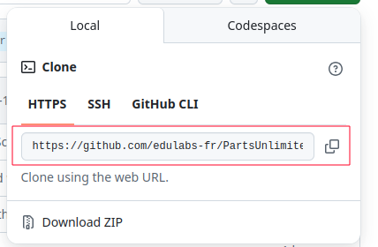

Dans ce guide, nous allons travailler en mode collaboratir, c'est à dire un admin récupérera un dépôt distant depuis Github, pour le mettre à disposition de toute une équipe de développeurs sur un répertoire partagé en local, les développeurs travailleront ensuite sur leur propre clone local, et commit leurs modifications vers le dépôt partagé.

# Cloner un Dépôt GitHub Distant et Créer un Clone Local

Le clonage d'un dépôt permet de créer une copie locale complète du dépôt distant, y compris tout son historique de versions.

### Préparer l'emplacement local du dépôt

*Dans un environnement partagé, assurez-vous de mettre en place les permissions nécessaires pour que les autres collaborateurs puissent accéder au dépôt cloné, tout en ayant une stratégie du moindre privilège, qui consite à ne donner que les droits nécessaires aux personnes concernés.*

Commençons par créer une répertoire destiné à accueillir le clonage du dépôt GitHub.

```bash
mkdir -p /mnt/projets/proj_a
cd /mnt/projets/proj_a
```

Dans mon cas j'ai un groupe se le nom `dev_proj_a` qui regroupe tous les developpeurs travaillant sur le projet A, je vais donc changer le owner du dossier et mettre le groupe `dev_proj_a` comme nouveau owner.

```bash
chown -R :dev_proj_a /mnt/projets/proj_a
chmod -R 770 /mnt/projets/proj_a
```

J'ajoute le bit `setgid` pour que tous les nouveaux fichiers et répertoires créés dans ce répertoire héritent du groupe parent.

```bash
chmod g+s /mnt/projets/proj_a
```

Tout nouveau fichier ou répertoire créé dans `/mnt/projets/proj_a` appartiendra automatiquement au groupe `dev_proj_a`.

J'ajoute le sticky bit pour que les utilisateurs ne puissent supprimer que leurs propres fichiers.

```bash
chmod +t /mnt/projets/proj_a
```

Ainsi, les membres du groupe `dev_proj_a` peuvent créer et modifier des fichiers dans ce répertoire, mais ne peuvent pas supprimer les fichiers des autres membres.

### Cloner le dépôt distant vers le répertoire partagé en local
Le dépôt distant que nous allons cloner est hébergé sur GitHub. Pour cloner un dépôt, nous avons besoin de son URL. Vous pouvez trouver cette URL sur la page du dépôt GitHub, généralement sous un bouton "Code" ou "Clone".



Utilisez la commande `git clone` suivie de l'URL du dépôt pour cloner le dépôt sur votre machine locale.

```bash
git clone https://github.com/nom-utilisateur/nom-depot.git
```
Remplacez `nom-utilisateur` et `nom-depot` par les informations appropriées du dépôt que vous souhaitez cloner.

L'utilisation du `.` à la fin de la commande est essentiel dans notre cas, car il indique à Git de cloner le dépôt dans le répertoire courant (`~/projets`), plutôt que de créer un nouveau sous-répertoire pour le dépôt.

### Vérifier le clonage
Une fois le clonage terminé, vous pouvez vérifier que le dépôt a été cloné correctement en listant le contenu du répertoire :

```bash
ls -la
```

On se retrouve avec un truc dans le genre:

```plaintext
total 20
drwxrws--T. 4 root dev_proj_a  115 Nov 14 04:46 .
drwxr-xr-x. 3 root root         20 Nov 14 04:44 ..
-rw-r--r--. 1 root dev_proj_a   73 Nov 14 04:46 CHANGELOG.md
drwxr-sr-x. 8 root dev_proj_a  163 Nov 14 04:46 .git
-rw-r--r--. 1 root dev_proj_a   11 Nov 14 04:46 .gitignore
-rw-r--r--. 1 root dev_proj_a   26 Nov 14 04:46 LICENSE
-rw-r--r--. 1 root dev_proj_a  297 Nov 14 04:46 Makefile
-rw-r--r--. 1 root dev_proj_a 1110 Nov 14 04:46 README.md
drwxr-sr-x. 2 root dev_proj_a   26 Nov 14 04:46 src
```

### Coté développeur : Cloner le dépôt partagé en local vers son clone local
Chaque développeur peut maintenant cloner le dépôt partagé en local vers son propre répertoire de travail.

mkdir ~/proj_a
cd ~/proj_a


```bash
git clone --local /mnt/projets/proj_a .
```

