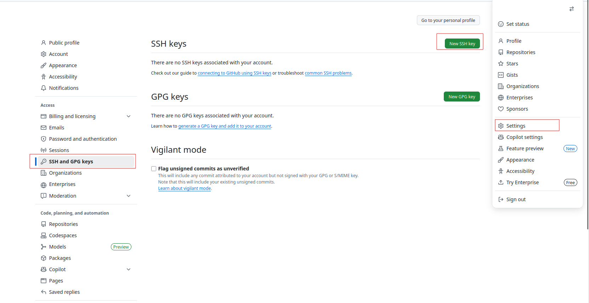

# 04 - Sécuriser l’Accès à GitHub avec une Clé SSH

Dans cette section, nous allons apprendre à sécuriser l’accès à GitHub en utilisant une clé SSH.
L’objectif est simple : remplacer l’authentification par mot de passe par une authentification cryptographique, plus sûre et plus pratique.

Ce mécanisme est essentiel en environnement professionnel, il permet de travailler avec GitHub sans ressaisir de mot de passe, tout en renforçant la sécurité des dépôts.

### Générer une clé SSH :
la première étape consiste à générer une paire de clés SSH (une clé publique et une clé privée) sur votre machine locale :

ssh-keygen -t ed25519 -C "Clé SSH pour GitHub"

le -C permet d’ajouter un commentaire pour identifier la clé plus facilement.

Git vous demandera : 
- le chemin où sauvegarder la clé (choisissez le votre ou appuyez sur Entrée pour le chemin par défaut)
- une passphrase (optionnelle mais recommandée pour plus de sécurité)

Une fois la clé générée, une image randomart sera affichée pour représenter visuellement la clé.

Si vous avez choisis le chemin par défaut, la clé privée sera stockée dans `~/.ssh/id_ed25519` et la clé publique dans `~/.ssh/id_ed25519.pub`.

**Si vous avez un gestionnaire de mot de passe (Keepass...) et vous devez en avoir un, vous pouvez y enregistrer la passphrase et la clé privée**

Exécuté la commande suivante pour afficher le contenu de la clé publique :
```bash
cat ~/.ssh/id_ed25519.pub
```
Copiez l’intégralité de la ligne affichée.

Cette clé contient un préfixe `ssh-ed25519` suivi d’une longue suite de caractères : c’est normal.

Vous avez la possibilité d'utiliser votre clé SSH pour s'authentifier et pour signé vos commits, Choisir `Authentication key` suffit totalement pour travailler sur un dépôt GitHub, mais si vous souhaitez également signer vos commits avec cette clé, vous devez répéter les étapes suivante deux fois et choisir `Signing key` à la deuxième reprise.

### Ajouter la clé SSH à votre compte GitHub :
Rendez-vous sur votre compte `GitHub` :
1. Allez dans les paramètres `Settings`
2. Dans le menu de gauche, cliquez sur `SSH and GPG keys`
3. Cliquez sur le bouton `New SSH key`
4. Donnez un nom explicite à votre clé (par exemple `Laptop perso`, `Laptop pro`)
5. Laissez le type sur `Authentication key`
6. Collez votre clé publique que vous venez de copier dans le champ `Key`
7. Validez




**Différence entre Clés SSH d’Authentification et Clés de Signature**

GitHub distingue deux types de clés SSH, chacune ayant un rôle bien spécifique :

- Clé d’authentification (Authentication Key) : C’est la clé classique utilisée pour accéder à vos dépôts GitHub.

Elle permet de :
    - cloner un dépôt,
    - pousser des modifications,
    - récupérer des mises à jour (git pull).

Si votre objectif est simplement de travailler avec vos dépôts, une clé d’authentification suffit.

- Clé de signature (Signing Key)

Une clé de signature sert à signer cryptographiquement vos commits.

Elle garantit :
    - que le commit provient réellement de vous,
    - qu’il n’a pas été modifié ou falsifié,
    - qu’un tiers n’a pas usurpé votre nom ou email Git.

Ce mécanisme renforce la confiance dans l’historique du projet, surtout dans les environnements professionnels ou open source.

### Conclusion

Vous avez maintenant :

- généré une clé SSH sur votre machine,
- ajouté cette clé à votre compte GitHub,
- testé l’accès sécurisé en clonant un dépôt via SSH.

Ce mode de connexion est indispensable pour travailler efficacement en environnement professionnel.


Dans ce guide, nous allons mettre en place un workflow collaboratif local avec Git, en utilisant un dépôt distant hébergé sur GitHub comme source initiale.:

- **Un administrateur** récupère un dépôt GitHub et crée un dépôt central partagé sur un répertoire commun.

- **Les développeurs** clonent ce dépôt central vers leurs répertoires personnels et poussent leurs modifications vers ce dépôt partagé.

Pour que cette collaboration fonctionne, il est indispensable d’utiliser un dépôt Git bare du côté serveur, afin que Git accepte les push sans risque d’incohérence.

## Coté Administrateur :
### Création du dépôt central
Nous allons créer un espace partagé dans /mnt/projets destiné à accueillir le dépôt central du projet. Le dépôt partagé utilisé comme point central doit être un dépôt bare, c’est-à-dire un dépôt Git sans working directory.

```bash
git init --bare /mnt/projets/proj_a.git
```

Dans cet exemple, tous les développeurs du projet A appartiennent au groupe Unix dev_proj_a.
Nous ajustons donc les permissions pour garantir :

- un accès restreint
- une collaboration fluide
- une gestion cohérente des permissions grâce au bit setgid

Mise en place des permissions :
```bash
chown -R root:dev_proj_a /mnt/projets/proj_a.git
chmod -R 2770 /mnt/projets/proj_a.git
```
Le dépôt central est maintenant prêt à recevoir des pushes.

### Importer un projet GitHub dans le dépôt central
L’administrateur récupère le dépôt GitHub dans sa zone personnelle :

git clone https://github.com/nom-utilisateur/nom-depot.git
cd nom-depot

À ce stade, vous êtes dans votre copie locale du projet GitHub :

```bash
/home/admin/nom-depot
```

Dans ce répertoire, Git conserve :

- votre espace de travail (fichiers visibles)
- le dossier .git/ contenant l’historique
- les branches
- les commits locaux

Ce clone va être utilisé pour pousser son contenu dans le dépôt central.

Or dans cette configuration, vous êtes désormais dans le répertoire local du projet github, cette copie pour l'instant n'est pas encore liée au dépôt partagé localement, elle est connectée uniquement au dépôt distant github. Et vous pouvez vérifier cela avec la commande:

```bash
git remote -v
```
Vous voyez que l'URL du dépôt distant github est bien référencée.

```bash
origin  https://github.com/nom-utilisateur/nom-depot.git (fetch)
origin  https://github.com/nom-utilisateur/nom-depot.git (push)
```

Si vous modifiez un fichier et que vous faites un `push` maintenant, vous pousserez vos modifications directement sur github.

Or, nous voulons pousser non pas vers GitHub, mais vers notre dépôt local /mnt/projets/proj_a.git.

On remplace l’origine GitHub par l’origine locale :
```bash
git remote remove origin
git remote add origin /mnt/projets/proj_a.git
```
Puis on pousse le code vers le dépôt bare (ma branche principale s'appelle main dans cet exemple) :
Vous pouvez vérifier le nom de votre branche principale avec la commande `git branch` avant de faire le push.

```bash
git push -u origin main
```
Le dépôt central contient maintenant l’intégralité du projet.


### (Optionnel) Créer un working directory partagé
Si vous souhaitez disposer d’une copie lisible par tous (pour un outil interne, un serveur web ou une revue), vous pouvez générer un working directory séparé :
```bash
git clone /mnt/projets/proj_a.git /home/admin/proj_a
```
Permissions :
```bash
chown -R root:dev_proj_a /mnt/projets/proj_a
chmod -R 2770 /mnt/projets/proj_a
```
Ce répertoire n'est pas un dépôt à utiliser pour travailler, mais une copie consultable.

## Coté Developpeur :
### Cloner le dépôt partagé en local vers son clone local
Chaque développeur doit travailler dans sa propre copie locale du dépôt.

Le développeur commence donc par créer un répertoire dédié dans le $HOME :

```bash
mkdir ~/proj_a
cd ~/proj_a
```
Ensuite, on déclare le dépôt partagé comme “safe directory” uniquement pour éviter les avertissements de sécurité Git :
```bash
git config --global --add safe.directory /mnt/projets/proj_a.git/
```
Puis on clone le dépôt bare :
```bash
git clone /mnt/projets/proj_a .
```
Le `.` signifie que Git place le clone directement dans le répertoire courant.

À ce stade, le développeur peut modifier les fichiers du projet, par exemple :
```bash
nano README.md
```
Puis il enregistrez les modifications :
```bash
git add .
git commit -m "Premier commit local"
git push origin master
```

Chaque développeur travaille dans son propre espace local, en toute autonomie. Lorsqu’il pousse ses modifications, Git les enregistre dans le dépôt central — le dépôt bare.
À ce stade, les changements sont bien présents dans le dépôt partagé… mais uniquement dans sa base de données Git interne.

Un dépôt bare n’a pas de copie directe des fichiers du projet :
il stocke les commits, les arbres, les blobs, mais pas de working directory.
Autrement dit, le dépôt central connaît parfaitement les nouvelles versions, mais il ne possède aucun fichier lisible comme README.md ou src/….

Pour rendre ces modifications visibles dans une copie de travail lisible par un humain (le working directory du dépôt partagé), il faut qu’un utilisateur — généralement l’administrateur, ou le propriétaire du clone de travail partagé — exécute :

```bash
git pull
```

Ce git pull ne contacte pas GitHub il agit localement :

- il récupère simplement les mises à jour depuis le dépôt bare et met à jour les fichiers du répertoire /home/<Admin>/proj_a. Le répertoire de travail ou l'administrateur a cloné le dépôt depuis github.
Ainsi, les fichiers du dépôt partagé reflètent fidèlement les derniers commits envoyés par les développeurs.

Git sépare donc clairement :

- le stockage interne des versions (dans le dépôt bare),
- et la mise à jour visible des fichiers (dans le working tree, via git pull).

Cette mécanique permet de travailler à plusieurs en conservant un dépôt central propre, fiable et adapté à la collaboration locale.


### Créer un dépôt Git central (bare)

Créons donc le dépôt central en mode bare dans le répertoire partagé.

```bash
git init --bare /mnt/projets/proj_a.git
```

On ajuste ses permissions :
```bash
chown -R root:dev_proj_a /mnt/projets/proj_a.git
chmod -R 2770 /mnt/projets/proj_a.git
```

Ce dépôt .git est désormais le remote officiel utilisé par toute l’équipe.

### Importer le dépôt GitHub dans le dépôt central

**Cloner le dépôt GitHub**

depuis un compte administrateur, clonons le dépôt GitHub distant sur la machine locale au niveau de son home (par exemple).

```bash
git clone https://github.com/nom-utilisateur/nom-depot.git
```

Git télécharge alors :

- tous les fichiers du projet
- toutes les versions précédentes
- tout l’historique complet du dépôt

et crée automatiquement un nouveau dossier du même nom que le dépôt GitHub. Si le projet s’appelle `nom-depot`, un dossier du nom `nom-depot` est créé.

**Entrer dans le dossier cloné**

```bash
cd nom-depot
```


Nous retirons donc l’origine GitHub :
```bash
git remote remove origin
```

Puis nous ajoutons le dépôt central local comme nouvelle origine :
```bash
git remote add origin /mnt/projets/proj_a.git
```

**Pousser le code vers le dépôt central**
Envoyez maintenant tout le contenu du dépôt (branches, commits…) vers le dépôt bare :
```bash
git push -u origin master
```

Le dépôt partagé /mnt/projets/proj_a.git contient désormais tout le projet GitHub, mais dans une version adaptée au travail collaboratif interne.

À partir de là, le dépôt partagé devient l’unique “source de vérité” pour l’équipe locale.


Edit le fichier README.md ensuite git add . et git commit -m "Premier commit local" puis git push origin master pour pousser les modifications vers le dépôt partagé.

tout les changement sont maintenant pris en compte par git.

cependant jusqu'à présent, seul l'administrateur peut intervenir pour pousser des modifications vers le dépôt partagé.

## Coté Administrateur :

git pull

maitnenant tout