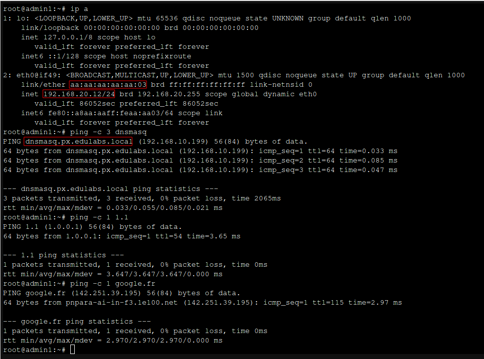
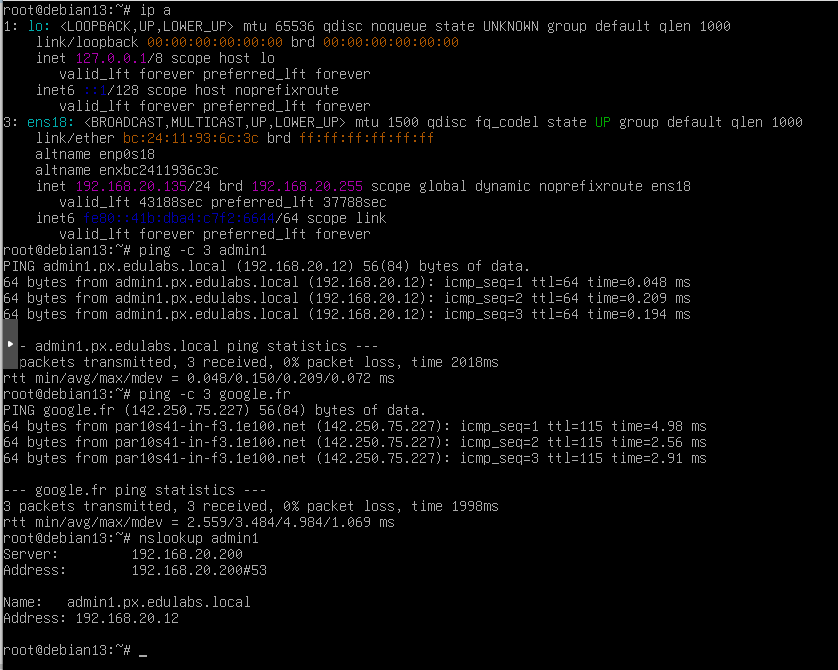
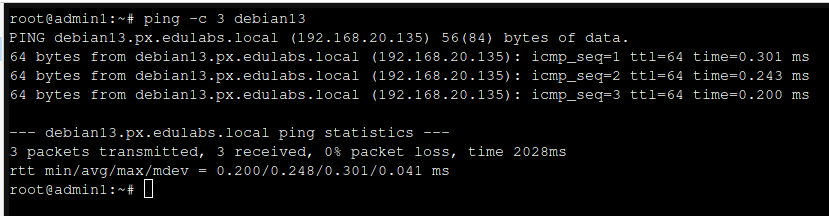
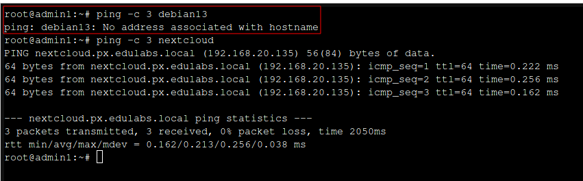

# dnsmasq

### Introduction
Dnsmasq est un service léger qui combine plusieurs fonctions essentielles pour un réseau local : un serveur DNS cache, un forwarder pour transmettre les requêtes vers des DNS externes, un serveur DHCP, et même un serveur TFTP/PXE pour le boot réseau si nécessaire.

Je l’utilise ici dans un environnement Proxmox, mais il convient tout aussi bien à un homelab, une infrastructure simple ou un réseau isolé.

Son intérêt est d’être **simple à configurer**, peu gourmand en ressources, et parfaitement adapté aux petits réseaux, labs, homelabs, environnements Proxmox, etc.

Dans cet article, je vous montre comment mettre en place dnsmasq afin qu’il fournisse :

- un DHCP classique ;
- un DHCP avec réservations MAC (MAC → IP fixe) ;
- un DNS avec auto-enregistrement des clients DHCP ;
- des enregistrements DNS manuels ;

le tout limité à une seule interface réseau, par exemple un bridge Proxmox dédié aux VMs.

### Installation
Sur une distribution basée sur Debian ou Ubuntu, l’installation est directe :
Pour ma part, j’ai un conteneur LXC dédié à dnsmasq dans Proxmox, avec deux interfaces réseaux : une vers le Bridge vmbr10 (LAN avec accès internet) et une vers vmbr20 (réseau isolé des VMs), et sur ce dernier que dnsmasq écoutera et distribuera les IP.

J'ai déclaré le DNS suivant `px.edulabs.local` pour mon réseau local, et l'IP 192.168.20.200comme DNS upstream.

Toutes les commandes ont été exécutées avec un compte ayant les privilèges root (sudo).

```bash
sudo apt update
sudo apt install dnsmasq
```

Si vous utilisez une distribution avec systemd-resolved, vérifiez qu’il ne monopolise pas le port 53 afin de ne pas interférer avec dnsmasq. Vous pouvez le faire en éditant `/etc/systemd/resolved.conf` et en mettant `DNSStubListener=no`, puis redémarrez systemd-resolved :

```bash
systemctl restart systemd-resolved
```

### Préparer une configuration propre

Je pars d’une configuration totalement épurée, en utilisant uniquement :

- /etc/dnsmasq.conf pour toute la configuration,
- un dossier dédié aux entrées DNS manuelles.

```bash
mv /etc/dnsmasq.conf /etc/dnsmasq.conf.bak
touch /etc/dnsmasq.conf
mkdir -p /etc/dnsmasq-hosts
```

### Fichier `/etc/dnsmasq.conf` complet pour DHCP + DNS avec auto-enregistrement

```bash
nano /etc/dnsmasq.conf
```

Et j'ai mis en place configuration suivante :

```conf
# --- Limiter dnsmasq à l’interface LAN des VMs ---
# Interface dans le conteneur (raccorder à un bridge sur le Proxmox)
interface=eth2

# Se binder strictement à cette interface
bind-interfaces

# N’écouter que sur l’adresse IP locale de cette interface (optionnel mais propre)
listen-address=192.168.20.200

# --- Domaine interne ---
# Domaine du LAN
domain=px.edulabs.local

# Ajoute automatiquement le domaine aux noms courts venant de /etc/hosts et addn-hosts
expand-hosts

# Ne pas forwarder les noms sans point vers l’upstream DNS
domain-needed

# Ne jamais forwarder les IP privées (RFC1918) vers l’upstream DNS
bogus-priv

# Taille du cache DNS
cache-size=512

# --- Serveurs DNS upstream (optionnel : sinon /etc/resolv.conf est utilisé) ---
# Par exemple Cloudflare + Google
server=1.1.1.1
server=8.8.8.8

# --- DHCPv4 : plage dynamique ---
# Réseau : 192.168.20.0/24
# Plage dynamique pour les machines "non critiques"
# Format : dhcp-range=<start>,<end>,<netmask>,<lease-time>
dhcp-range=192.168.20.100,192.168.20.200,255.255.255.0,12h

# Passerelle par défaut (gateway du LAN)
# Option 3 = router
dhcp-option=3,192.168.20.254

# DNS envoyé aux clients (on se met soi-même)
# Option 6 = DNS server
dhcp-option=6,192.168.20.200

# Domaine envoyé côté DHCP
dhcp-option=15,px.edulabs.local

# --- DHCP : réservations MAC -> IP + hostname ---
# VM critique 1
# MAC de la VM, IP fixe, hostname, durée du bail
dhcp-host=AA:AA:AA:AA:AA:01,192.168.20.10,vm1,24h

# VM critique 2
dhcp-host=AA:AA:AA:AA:AA:02,192.168.20.11,db1,24h

# VM d’admin
dhcp-host=AA:AA:AA:AA:AA:03,192.168.20.12,admin1,24h

# Remarque :
# - Ces IP (10,11,12) sont EN DEHORS de la plage dynamique (50-200), mais dans le même sous-réseau.

# --- Fichier d’entrées DNS manuelles supplémentaires ---
addn-hosts=/etc/dnsmasq-hosts/local-hosts

# --- Logs (optionnel, utile pour debug) ---
log-queries
log-dhcp
#log-facility=/var/log/dnsmasq.log
```

### Enregistrements DNS manuels : `/etc/dnsmasq-hosts/local-hosts`
Je place mes enregistrements non-DHCP dans un fichier séparé :

```bash
nano /etc/dnsmasq-hosts/local-hosts
```

voici son contenu, que pouvez adapter selon vos besoins :

```conf
# Enregistrements DNS manuels supplémentaires
192.168.20.2   nas
192.168.20.3   backup
192.168.20.4   registry
192.168.20.10  vm1
192.168.20.11  db1
192.168.20.12  admin1
```

Grâce à `expand-hosts` + `domain=px.edulabs.local`, dnsmasq génère automatiquement des enregistrements complets : :

- `nas.px.edulabs.local` → 192.168.20.2
- `backup.px.edulabs.local` → 192.168.20.3
- `registry.px.edulabs.local` → 192.168.20.4

### Vérification et démarrage

Avant de démarrer le service, je vérifie la syntaxe :

```bash
sudo dnsmasq --test
```

Si tout est OK, vous aurez le message `dnsmasq: syntax check OK.`, 

Je redémarre le service dnsmasq :

```bash
sudo systemctl restart dnsmasq
```

Je vérifie que mon service est bien actif, et ne présente pas d’erreurs :

```bash
sudo systemctl status dnsmasq
```

Je conseille également d’activer le service au démarrage :

```bash
sudo systemctl enable dnsmasq
```

### Tests dans un environnement Proxmox

J’ai ensuite créé un conteneur Debian sous Proxmox (LXC) nommé admin1, connecté au bridge vmbr20 avec une MAC fixe correspondant à ma réservation, et une configuration réseau en DHCP:

```bash
AA:AA:AA:AA:AA:03
```

Pour le DNS j'ai mis mon domaine `px.edulabs.local` et l'IP de dnsmasq `192.168.20.200`.


Au démarrage du conteneur :

- il a bien récupéré son adresse réservée : 192.168.20.12,
- le domaine fourni est bien px.edulabs.local,
- la résolution DNS fonctionne depuis le conteneur,
- la résolution inverse (PTR) fonctionne également côté dnsmasq,
- l’accès à des domaines publics fonctionne (dnsmasq transfère correctement aux upstream DNS).



***Pour pousser le test plus loin, j'ai créer une autre VM sans réservation MAC, qui a obtenu une IP dynamique dans la plage 100-200, ainsi que la configuration réseau (gateway, DNS) correcte via DHCP.***

Ayant utilisé un clone, le hostname par défaut est debian13, j'ai fais le test avec pour vérifier la prise en charge du changement de hostname et l'auto-enregistrement DNS.



En remière étape , j'ai vérifié que la résolution DNS fonctionnait bien avec le hostname initial, étape donnée que la machine est lancé avec le hostname `debian13`, alors dnsmasq a automatiquement créé l'enregistrement DNS `debian13.px.edulabs.local` pointant vers l'IP dynamique attribuée.

Depuis le conteneur admin1, j'ai pu faire un ping sur la machine `debian13.px.edulabs.local` :
```bash
ping -c 3 debian13.px.edulabs.local
```



Ensuite, j'ai modifié le hostname de la VM debian13 en `nextcloud` et redémarré la VM :

```bash
hostnamectl set-hostname nextcloud && reboot now
```

La prise en compte du nouveau hostname a été vérifiée via un ping depuis admin1 :

```bash
ping -c 3 nextcloud.px.edulabs.local
```



Comme vous pouvez le constater dans la capture ci-dessus, le ping vers `nextcloud.px.edulabs.local` fonctionne parfaitement, contrairement à `debian13.px.edulabs.local` qui n'est plus résolu. Et tout cela sans aucune intervention manuelle sur dnsmasq.


Voilà on arrive à la fin de ticket, merci d'avoir lu jusqu'au bout !


## Quelques ressources supplémentaires :

### Ce que fait dnsmasq pour les IP dynamiques (192.168.20.x)

Avec la configuration suivante :

```conf
dhcp-range=192.168.20.50,192.168.20.200,255.255.255.0,12h
expand-hosts
domain=px.edulabs.local
log-dhcp
log-queries
```

Lorsqu’une VM démarre :

1. elle demande une IP via DHCP ;
2. elle envoie son hostname (DHCP option 12 ou FQDN option 81) ;
3. dnsmasq :

    - attribue une IP,
    - enregistre l’ensemble dans /var/lib/misc/dnsmasq.leases,
    - crée un enregistrement DNS :
        - hostname.px.edulabs.local → adresse.IP,
    - ajoute l’entrée PTR inversée.

Ainsi, même une machine prenant 192.168.20.100 aura automatiquement :

```bash
100.20.168.192.in-addr.arpa → hostname
hostname.px.edulabs.local → 192.168.20.100
```

### Où sont stockés les baux (IP + Enregistrements DNS) ?

Tous les enregistrements dynamiques (données DHCP et DNS associés) sont conservés ici :

/var/lib/misc/dnsmasq.leases

Vous pouvez vérifier ce fichier pour voir les baux actifs.


### Explication des options utilisées dans le fichier de configuration `/etc/dnsmasq.conf` :
- `cache-size=256` : Définit la taille du cache DNS à 256 entrées.
- `domain-needed` : Ce paramètre bloque la résolution des noms incomplets. Une requête pour `serveur` reste locale et n’est jamais envoyée aux résolveurs externes. En revanche, `serveur.exemple.com` peut être résolue via les upstream DNS. C’est un garde-fou pour éviter des fuites vers le FAI ou le DNS public.
- `expand-hosts` : Cette option permet d’ajouter automatiquement le domaine spécifié (ici `domain=px.edulabs.local`) aux noms d’hôtes locaux. Par exemple, si vous avez une entrée DHCP pour un hôte nommé `serveur`, avec cette option, dnsmasq le résoudra en `serveur.px.edulabs.local`.
- `bogus-priv` : Cette option empêche dnsmasq de répondre aux requêtes pour les adresses IP privées (comme 192.168.x.x, 10.x.x.x, etc.) qui ne sont pas dans le réseau local. Cela aide à éviter les fuites DNS vers l’extérieur pour les adresses privées.
- `interface=eth0` : Spécifie l’interface réseau sur laquelle dnsmasq doit écouter les requêtes DNS et DHCP. Remplacez `eth0` par l’interface appropriée de votre système. Sur des hôtes avec plusieurs interfaces, dont un accès WAN et LAN, cela permet de restreindre dnsmasq à l’interface LAN uniquement.
- `domain=px.edulabs.local` : Définit le domaine local pour les hôtes gérés par dnsmasq. Cela permet à dnsmasq de compléter automatiquement les noms d’hôtes locaux avec ce domaine.


