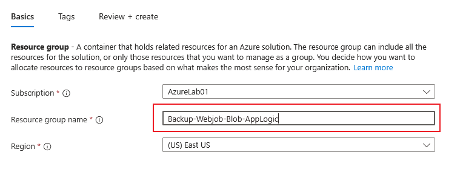

Création d'un groupe de ressource spécifique au lab :

Premièrement nous allons commencer par créer nos comptes de stockage : 

- Compte de stockage source
- compte de stockage destination qui servira de backup

Dans ces comptes de stockage on va utiliser la partie blob, dans le premier on mettera des fichiers qu'on téléversera manuellement, et ensuite nous allons utiliser une webApp avec un webjob pour compresser et copier le contenu depuis le source vers le compte de backup, et cela tout les jours à minuit.

